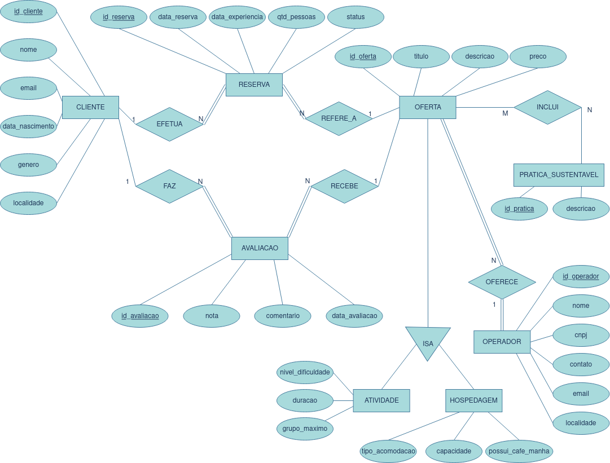
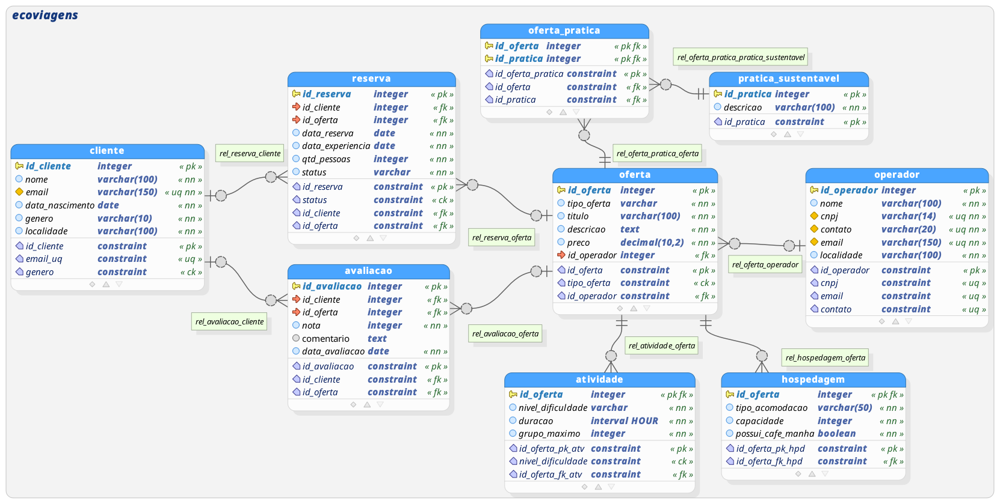
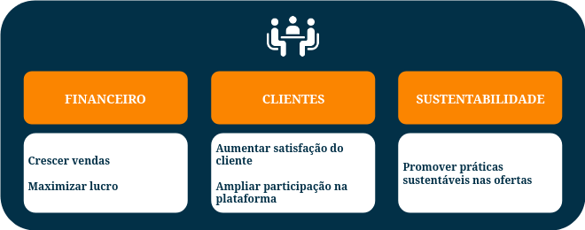

# Projeto EcoViagens — Análise e Inteligência de Negócios em Turismo Sustentável  

## 📘 Visão Geral  

O presente projeto foi desenvolvido com o objetivo de avaliar o **desempenho operacional da EcoViagens** em seu primeiro ano de atividade, uma startup de turismo sustentável voltada à oferta de experiências ecológicas em parceria com operadores locais.  

O trabalho foi estruturado em três etapas principais que representam o ciclo analítico completo:  

1. **Modelagem de Dados** – construção do modelo relacional que sustenta a operação e possibilita análises consistentes;  
2. **Análise (SQL)** – investigação exploratória e respostas às principais perguntas de negócio;  
3. **Dashboard (Power BI)** – criação de uma visão executiva para monitoramento contínuo da operação.  

O projeto adota uma abordagem **orientada a negócios**, buscando traduzir dados em **decisões estratégicas e ações práticas**, alinhadas ao posicionamento sustentável da marca.  

---

## 🧩 Modelagem de Dados  

A etapa de **Modelagem de Dados** foi o ponto de partida do projeto, com o objetivo de estruturar as informações da EcoViagens de forma organizada e analiticamente útil.  

O processo seguiu as seguintes etapas:  

1. **Levantamento dos processos de negócio** – identificação dos principais fluxos operacionais da empresa (reservas, ofertas, clientes, avaliações e práticas sustentáveis);  
2. **Modelagem conceitual** – elaboração do diagrama entidade-relacionamento (DER), representando como os dados se conectam entre si;  
3. **Modelagem lógica** – tradução do modelo conceitual em um modelo relacional, definindo chaves primárias, estrangeiras e atributos relevantes de cada tabela;  
4. **Criação e povoamento do banco** – implementação das tabelas no banco de dados e inserção dos dados simulados;  
5. **Validação da estrutura** – verificação de integridade referencial e coerência das relações antes da etapa de análise.  

A modelagem permitiu construir uma **base sólida para análises SQL e visualizações no Power BI**, garantindo consistência entre indicadores e clareza na interpretação dos resultados.  

📊 **Principais Entidades:**
- **Cliente** – informações sobre o usuário que realiza reservas;  
- **Reserva** – registro das compras e do histórico de experiências;  
- **Oferta** – descrição das experiências disponíveis;  
- **Avaliação** – notas e comentários dos clientes sobre as experiências;  
- **Prática Sustentável** – práticas ambientais associadas às ofertas.  

📷 **Modelo Conceitual**  




📷 **Modelo Lógico**  




📄 [Ver relatório de modelagem](./modeling/1.%20MODELAGEM%20DE%20DADOS.pdf)

---

### 📊 Definição de KPIs

Com o modelo de dados estruturado e as principais fontes de informação consolidadas, o passo seguinte foi definir **os indicadores-chave de desempenho (KPIs)** que orientariam a análise e o acompanhamento da operação.

O processo teve início com a **identificação dos objetivos estratégicos do negócio**, que, neste caso, estavam relacionados à satisfação dos clientes, à saúde financeira da operação e à promoção   de   práticas  sustentáveis. A partir desses objetivos, derivaram-se os **KPQs (Key Performance Questions)** — perguntas fundamentais para avaliar se os resultados estavam alinhados ao planejado.



Com base nessas questões, foram definidos os **KPIs principais**, utilizados tanto na etapa de análise SQL quanto na construção do dashboard. Entre eles:

* **Ticket Médio por Reserva**
* **Receita Total**
* **Avaliação Média**

📎 *[Relatório completo de definição de KPIs](./relatorios/02_definicao_kpis.pdf)*

---

## 🧮 Análise — SQL  

Com o banco relacional devidamente estruturado e populado, foi realizada uma série de **consultas SQL analíticas** voltadas a responder às principais **perguntas de negócio** levantadas pela EcoViagens, entre elas:  

- Qual o desempenho mensal da operação em número de reservas e receita?  
- Qual é a avaliação média das experiências?  
- Quantas ofertas possuem práticas sustentáveis implementadas?  
- Quais práticas sustentáveis aparecem com mais frequência nas reservas concluídas?  

Exemplo de consulta:
```sql
/* =====================================================
BLOCO: VENDAS
Objetivo: Entender faturamento, ticket médio e fidelização
===================================================== */
-- Quanto a empresa está faturando com experiências sustentáveis?
-- Receita Bruta Mensal (considera apenas reservas concluídas)
WITH
	RECEITARESERVAS AS (
		SELECT
			DATE_PART('year', R.DATA_RESERVA) AS ANO_RESERVA,
			DATE_PART('month', R.DATA_RESERVA) AS MES_RESERVA_NUM,
			SUM(R.QTD_PESSOAS * O.PRECO) AS RECEITA_RESERVA_MES
		FROM
			ECOVIAGENS.RESERVA R
			JOIN ECOVIAGENS.OFERTA O ON O.ID_OFERTA = R.ID_OFERTA
		WHERE
			R.STATUS = 'Concluída'
		GROUP BY
			1,
			2
	)
SELECT
	CONCAT(
		RR.ANO_RESERVA,
		'/',
		TRIM(
			TO_CHAR(
				MAKE_DATE(RR.ANO_RESERVA::INT, RR.MES_RESERVA_NUM::INT, 1),
				'Mon'
			)
		)
	) AS MES_RESERVA,
	RR.RECEITA_RESERVA_MES,
	ROUND(
		100.0 * (
			(
				RR.RECEITA_RESERVA_MES / LAG(RR.RECEITA_RESERVA_MES) OVER (
					ORDER BY
						RR.ANO_RESERVA,
						RR.MES_RESERVA_NUM
				)
			) - 1.0
		),
		2
	) AS VARIACAO_PCT
FROM
	RECEITARESERVAS RR;
```

As análises revelaram, entre outros resultados:  
- **Receitas consistentes** ao longo do ano, com sazonalidade natural entre os períodos de férias;  
- **Avaliação média de 2,99/5,00**, sinalizando oportunidade de melhoria na experiência do cliente;  
- **66,83% das ofertas** com práticas sustentáveis, o que representa um bom ponto de partida, mas ainda abaixo do ideal estratégico.  

As consultas SQL foram documentadas e organizadas por bloco temático, permitindo **reprodutibilidade e transparência analítica**.  

📄 [Ver relatório de análise SQL](./analysis/3.%20ANÁLISE%20-%20SQL.pdf)

---

## 📊 Dashboard — Power BI  

Com base na modelagem e nas análises realizadas, foi desenvolvido um **dashboard de Visão Geral da Operação**, com foco em oferecer **monitoramento contínuo e suporte à decisão**.  

### Estrutura do Dashboard  
O painel foi dividido em três **visões principais**:  
- **Visão Temporal**  — evolução mensal das receitas, reservas, ticket médio e avaliação média;
- **Visão por Destino** – desempenho comparado entre localidades;
- **Sustentabilidade** — comparação entre ofertas com e sem práticas (CP e SP).

As métricas principais exibidas no topo do dashboard são:  
- Total de Reservas Concluídas  
- Receita Total  
- Avaliação Média  
- % Reservas com Práticas Sustentáveis
- Ticket Médio
- % Cancelamento  


Recursos adicionais como **drill through** e **tooltips** foram utilizados para aprimorar a navegação e a profundidade analítica, tornando o dashboard uma ferramenta de **análise dinâmica e exploratória**.


---

## 🧭 Conclusões e Recomendações  

O projeto da EcoViagens demonstra o **potencial de um pipeline analítico completo**, que conecta modelagem de dados, análise SQL e visualização executiva em um mesmo fluxo de valor.  

Os principais aprendizados incluem:  
- A **importância da modelagem relacional** para garantir consistência entre indicadores;  
- O uso de SQL como **ferramenta central de exploração e validação de hipóteses**;  
- A integração entre análise e visualização, permitindo **monitorar continuamente os resultados** obtidos.  

### Recomendações  
- Trabalhar na **melhoria da experiência do cliente**, especialmente nas ofertas com avaliações baixas;  
- Ampliar o **percentual de ofertas com práticas sustentáveis**, reforçando o posicionamento da marca;  
- Utilizar o dashboard como **ferramenta de acompanhamento e feedback** para os operadores parceiros;  
- Expandir a base de dados com informações de clientes, permitindo análises de comportamento e retenção.  

Com essa base sólida, a EcoViagens está preparada para **evoluir de uma visão descritiva para uma visão preditiva**, explorando análises avançadas e modelos de recomendação no futuro.  

---

## 📂 Estrutura do Projeto  

```
EcoViagens/
├── analysis
│   ├── 3. ANÁLISE - SQL.pdf
│   ├── media_avaliacoes_ofertas.png
│   ├── media_pessoas_reserva.png
│   ├── novos_clientes_mes.png
│   ├── queries-analise.sql
│   ├── receita_bruta_mensal.png
│   ├── receita_mensal_variacao.png
│   ├── ticket_medio_pessoa.png
│   └── ticket_medio_reserva_mensal.png
├── dashboard
│   ├── 4. DASHBOARD - POWER BI.pdf
│   ├── Avaliacao DT.png
│   ├── Ecoviagens Analise.png
│   ├── ecoviagens-home-analise.pdf
│   ├── Receita DT.png
│   ├── Reservas DT.png
│   └── Ticket Médio DT.png
├── data
├── ecoviagens-logo.png
├── kpis
│   ├── 2. INDICADORES DE DESEMPENHO (KPIS).pdf
│   ├── 2. KPIS - QUADRO.xlsx
│   └── strategy-map.png
├── modeling
│   ├── 1. MODELAGEM DE DADOS.pdf
│   ├── 1. MODELO DE DADOS - CONCEITUAL + LOGICO.xlsx
│   ├── create_tables.sql
│   ├── ecoviagens_database_model.png
│   ├── ecoviagens.dbm
│   └── ecoviagens_diagrama_er_conceitual.png
├── presentation
├── README.md
└── utils
```

--- 

📧 **Autor:** Manoel Castro  
[](https://www.linkedin.com/in/manoelcastront) 
[](https://medium.com/manoelcastront)
[](https://github.com/manoelcastro.nt)
